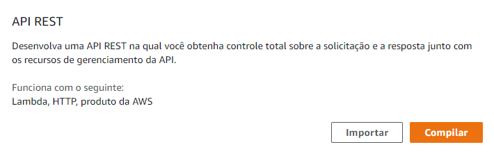
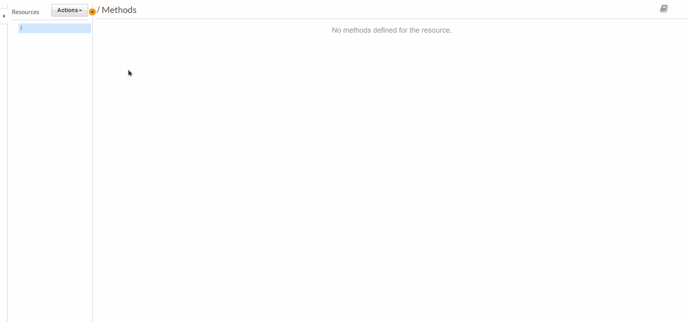
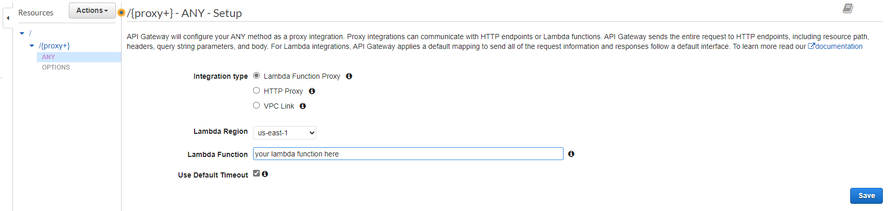
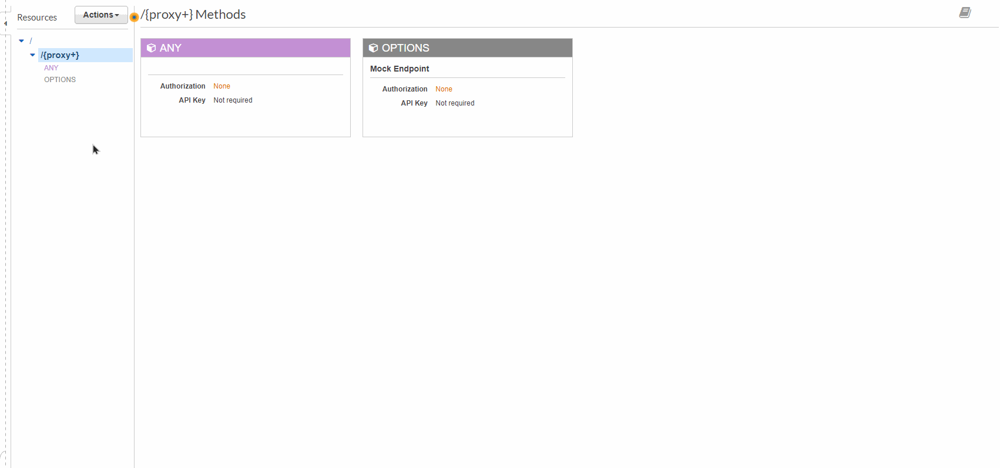
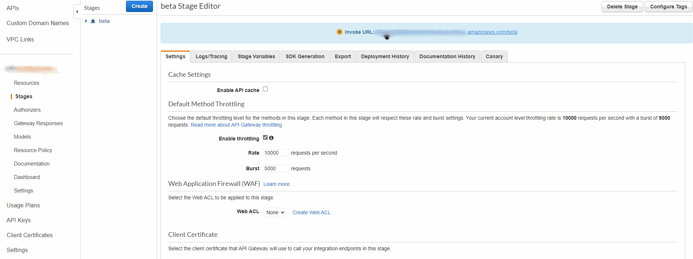

# Introduction

Run serverless application with AWS Lambda and AWS API Gate

---

### **How to install**

To install serverless command on console you need to install it globally (-g is not needed in linux)

```bash
yarn install -g serverless
```

Install all dependecies

```bash
yarn install
```

---

### Run locally

**With hot-reload using Nodemon**

```bash
yarn run dev
```

---

### This repository endpoints

If you try to access some endpoint that doesn't exist the app will return an error with a list of the available endpoints and methods.

---

### Upload to AWS Lambda

Run command to keep only production depencies

```
yarn run build
```

ZIP all files and you can now upload the zipped folder to AWS Lambda.

Folder size should be around 1.45 Mb size which allows you to be able to edit the code in AWS Lambda code editor.

---

### How to create API Gateway with Proxy

*Note: before create API Gateway I advise you to create AWS Lambda as you are going to insert the function name in API Gateway.*

Create API Gateway with API REST type.



Type you API name, description and endpoint type. If you don't know API Type leave the default value (regional).

After created, click on Actions and Create Resource. Check Configure as proxy resource and Enable API Gateway CORS (this one is optional).



Enter your AWS Lambda function name and click Save.



Now select root path, go to Actions and select Deploy API. Enter your stage and a description.



You can view API Gateway URL going to Stages and selecting the stage you created.


